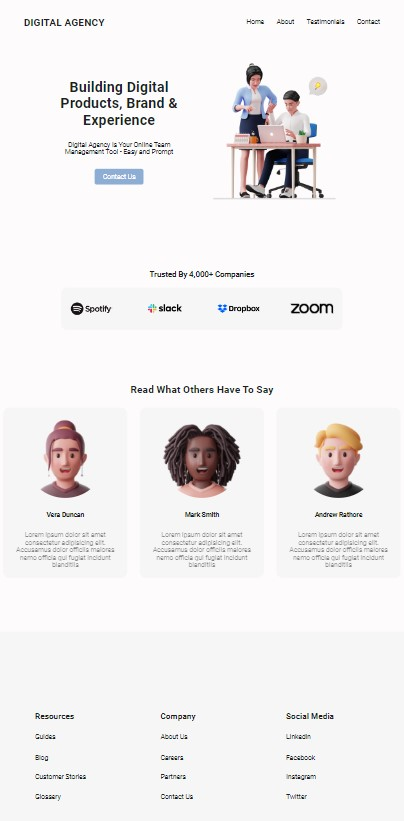

# Digital Agency - Flexbox Landing Page

**English**

This project is a responsive landing page for a digital agency, built with HTML, CSS (Flexbox), and JavaScript. It features a modern design, testimonials, partner logos, and a contact section. The navigation menu is mobile-friendly and includes a hamburger menu for small screens.

> This project is part of a Master of Cybersecurity assignment for The Power Education.

---

## Practice Instructions

Create an HTML and CSS file for an application of your choice. You can use a landing page design from Figma ([see example here](https://www.figma.com/community/file/1117815114206690225)).

- You do not need to replicate a full Figma design; just creating the header, a main with a couple of sections, and the footer is enough.

Example of a solution:

### Practice Submission

Remember to use everything learned so far, make the page responsive, and above all, focus on using good flexbox practices to make adaptive/responsive layouts and properly position elements on the page.

This application should look equally good on desktop, tablet, and mobile. Before submitting, make sure it works on any device without issues.

Remember, the Figma shown is just an example. You can create any landing page you want as long as you use display:flex for most of the element positioning.

---

**Español**

Este proyecto es una landing page responsiva para una agencia digital, desarrollada con HTML, CSS (Flexbox) y JavaScript. Incluye un diseño moderno, testimonios, logotipos de socios y una sección de contacto. El menú de navegación es adaptable a móviles e incluye un menú hamburguesa para pantallas pequeñas.

> Este proyecto forma parte de un trabajo del master de ciberseguridad de The Power Education.

---

## Instrucciones de la práctica

Crear un archivo HTML y un CSS de una aplicación que elijáis, podéis coger un diseño de una landing page en Figma ([ver ejemplo aquí](https://www.figma.com/community/file/1117815114206690225)).

- No hay que replicar un Figma elegido al completo, con hacer el header, un main con un par de secciones y el footer, sería suficiente.

Ejemplo de resolución:

### Entrega de la práctica

Recordad que debéis utilizar todo lo visto anteriormente, hacer la página responsive y sobre todo tenéis que centraros en utilizar buenas prácticas de flex para hacer más fácilmente el adaptative/responsive y colocar bien nuestros elementos en la página.

Esta aplicación se debe de ver igual de bien en desktop, tablet y mobile, por lo que antes de entregarla hay que tener por seguro que funciona en cualquier dispositivo sin problema.

Recordad que el Figma mostrado es solo un ejemplo, podéis crear la Landing Page que queráis siempre y cuando utilicéis en casi su totalidad display:flex para el posicionamiento de elementos.
